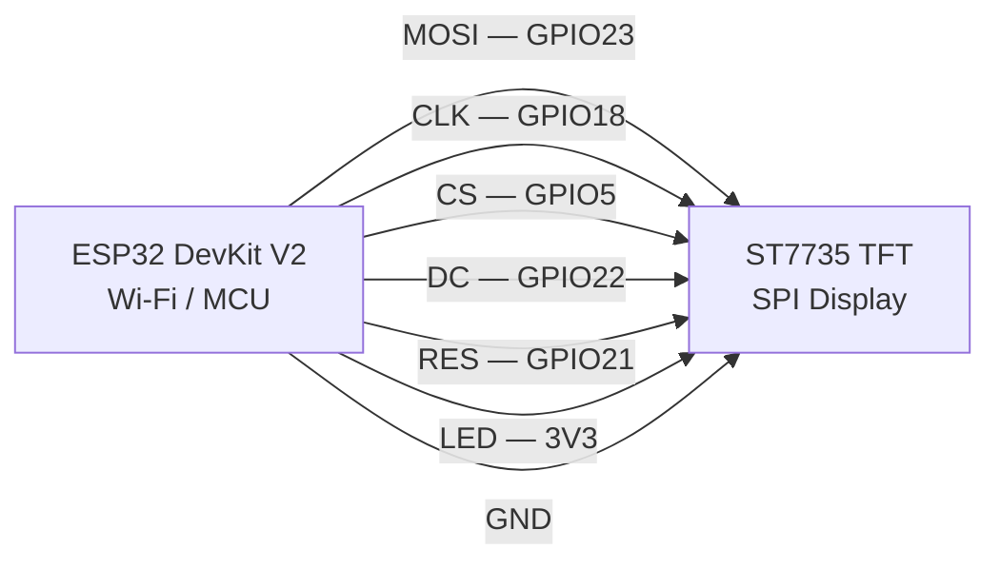

# Smell-It 🍄

This repository is a personal IoT hobby project focused on experimenting with different types of sensors and data collection techniques. The goal is to test and evaluate various environmental sensors to later develop a system capable of identifying optimal locations for mushroom growth.

## ✨ Features

✅ Gas/odor detection (MQ-series sensor)

✅ ESP32 Wi-Fi SoftAP provisioning (NVS stored)

✅ TCP server for real-time communication

✅ TFT display UI (ST7735)

✅ Deep-sleep logic (wake via touch)

## 🔧 Hardware Requirements

| Component            | Description        |
| -------------------- | ------------------ |
| ESP32 DevKitC V2     | MCU board          |
| MQ-series gas sensor | Gas / odor sensing |
| ST7735 TFT Display   | UI                 |
| ESP32 Touch Pad      | User input / wake  |
| USB 5V supply        | Power              |

## 🖥️ Hardware & Wiring

| Component       | Model               |
| --------------- | ------------------- |
| Microcontroller | ESP32 DevKit V2     |
| Display         | ST7735 1.8" SPI TFT |
| Gas sensor      | MQ-2                |
| Touch           | None                |

### Wiring Diagram

| ESP32 Pin | ST7735 Pin |
| --------- | ---------- |
| GND       | GND        |
| 5V        | VCC        |
| 3V3       | LED        |
| 23        | SDA / MOSI |
| 18        | SCK        |
| 5         | CS         |
| 22        | A0 / DC    |
| 21        | RESET      |

## 🚀 Getting Started (VS Code + ESP-IDF)

### Make sure you have:

- Visual Studio Code

- ESP-IDF VS Code Extension installed

- ESP-IDF v5.3.2 environment set up

- ESP32 USB driver installed

### 🔧 Configure Target Board

    Open command palette:

        ESP-IDF: Set Target

        Select your chip (e.g., esp32, esp32s2, esp32s3).

### ⚡ Quick Flash via VS Code Shortcut

This project includes a custom VS Code tasks.json that lets you flash the ESP32 with a single keyboard shortcut — no command typing required.

▶️ Flash Shortcut

    Press:

        Ctrl + Shift + B

        (or your configured keybinding)

## 📡 Usage

| Action   | Description             |
| -------- | ----------------------- |
| Wi-Fi    | Auto creates **SoftAP** |
| SSID     | `WIFI-ESP`           |
| PW       | `87654321`              |
| TCP Port | `3333`                  |
| Touch    | Wake / ESP32 touch pin  |
| Sleep    | Auto deep sleep ( 5min )|

## 📂 Project Structure

        /main
        ├── wifi_manager
        ├── tcp_server
        ├── display
        ├── touch
        ├── variables
        └── deepsleep
        /components
        ├── arduino
        ├── adafruit_txt
        ├── adafruit_gfx
        ├── adafruit_busio
        └── mq2
        /docs
        ├── ESP32
        ├── ST7335
        ├── MQ-2
        └── images
        /external
        /firmware

##  Development Notes

- ESP-IDF 5.3.2

- FreeRTOS task separation for UI / network / sensor logic

- Component-based codebase for clean modularity

## 🙌 Credits

Built with ❤️ and caffeine for embedded systems by @balugulb  
Inspired by IoT environmental sensing research and ESP32 community projects.

## 🌐 Links

| Resource     | Link                                                                                       |
| ------------ | ------------------------------------------------------------------------------------------ |
| GitHub Repo  | *this project*                                                                             |
| ESP-IDF Docs | [https://docs.espressif.com/projects/esp-idf](https://docs.espressif.com/projects/esp-idf) |                                       
