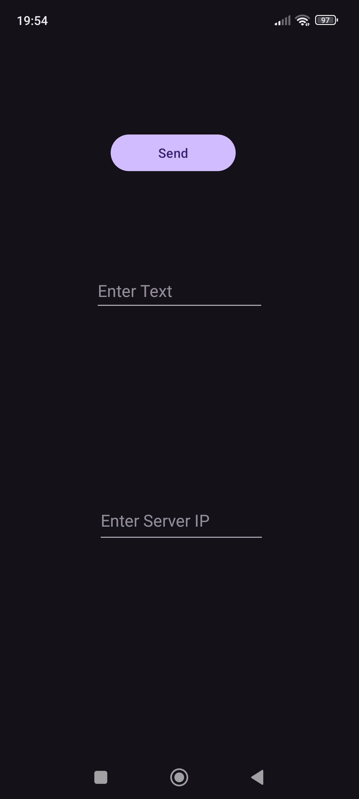

#  Note
This is my own app for my phone and intended to create an TCP client on my phone to send data to the ESP32.

**Usage:** 1. connect to WIFI-ESP    
           2. start App   
           3. input Server-IP = 192.168.4.1   
           4. input Text = data to send  
           5. press send  

**Tested on:** Redmi Note 11, Android 13